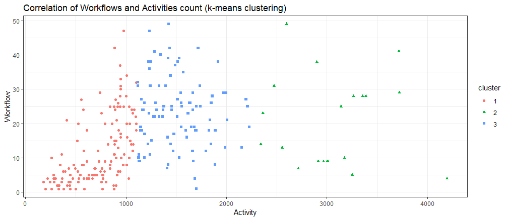

## Objective

This is an exploratory data analysis to figure out what are the factors that most impact on workflow development quality?

First of all, we would like to take a look at the correlation of workflows and activities to get a wild view.

## Prerequisite
I will use several libraries as below.
```{r}
library("readr")
library("ggplot2")
library("ggthemes")
library("reshape2")
library("cluster")
```

We need `Overview.csv` from CodeAnalyzer result to visualize this.
```{r}
overview = read_csv("../../data/Overview.csv")
```

## Data shaping
The data table needs a bit of shaping.
```{r}
shptbl = dcast(overview, ProjectName~Category, value.var = "Value", sum)
colnames(shptbl) <- c("Project", "Activity", "Log", "Workflow")
shptbl = subset(shptbl, Workflow>0, select = c(Activity,Workflow))
```

## Statistical analysis
Then conduct k-means clustering with Hartigan & Wong algorithm.
Cluster is set to 3.
```{r}
cls = kmeans(shptbl, 3)
shptbl$cluster = factor(cls$cluster)
```

## Visualization
Finally, visualize on scatter plot. (neatly)

```{r}
ggplot(data = shptbl, aes(x = Activity, y = Workflow)) +
  geom_point(aes(color = cluster, shape = cluster)) +
  theme_bw() + #  scale_color_bw() +
  ggtitle("Correlation of Workflows and Activities count (k-means clustering)")
```

